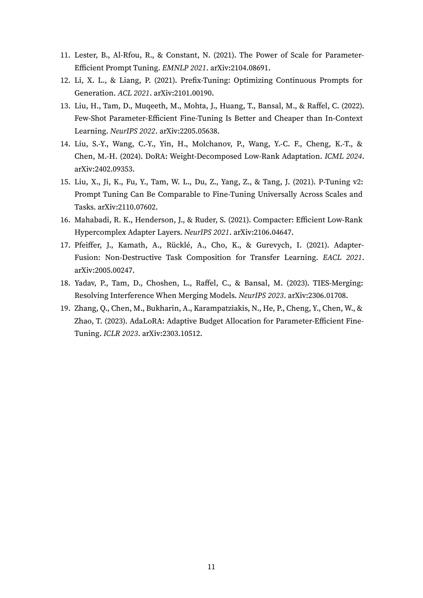

<div align="center">

# docspec

**跟 AI agent 一起寫長篇技術文件，產出乾淨的 Markdown 與排版完整的 PDF，過程中保持前後一致。**


<!-- TODO: repo 公開後補 CI 徽章 https://github.com/<owner>/docspec/actions -->

English: [README.en.md](README.en.md)

</div>

> [!WARNING]
> **使用邊界 (Usage Boundaries)**
> 本專案採 PolyForm Noncommercial 1.0.0 授權，**嚴格禁止任何商業使用**。
> - ✅ **允許的場景 (Non-commercial)**：個人寫作、學術研究、學生專題、開源專案 (Open Source) 的文件維護、個人技術部落格或不收費的社群分享。
> - ❌ **禁止的場景 (Commercial)**：寫小說、書籍、教材並拿去販售營利、作為公司的內部文件管理系統 (Wiki, KB)、撰寫公司商業產品的規格書或開發文件。

你跟 agent 先把每一節的邏輯與決策講清楚，docspec 再把它渲染成散文，同時守住結構。文件變長時不容易自相矛盾。你只看渲染出來的成品，後台的細節交給 agent。

## 端到端產出實證 (Showcase)

六份文件——三種文體（小說／隨筆／學術綜述）× 中英雙語，每份皆由 AI agent 從零驅動 docspec 寫成。六份全數通過結構、潔淨、渲染忠實度閘門並匯出排版 PDF，為原始跑出的結果，未經手動修改或挑選。

| 文體 | 語言 | 讀全文 | PDF | 篇幅 | 引擎閘 | 盲審風格 |
|---|---|---|---|---|---|---|
| 小說（短篇） | 中 | [讀](docs/showcase/deliverables/novel-zh.md) | [PDF](docs/showcase/pdfs/novel-zh.pdf) | 6 節 / ~3500 字 | ✓ | AI腔 5/5、流暢 5/5 |
| 小說（短篇奇幻） | 英 | [讀](docs/showcase/deliverables/novel-en.md) | [PDF](docs/showcase/pdfs/novel-en.pdf) | 5 節 / ~2200 字 | ✓ | AI腔 4/5、流暢 5/5 |
| 隨筆 | 中 | [讀](docs/showcase/deliverables/essay-zh.md) | [PDF](docs/showcase/pdfs/essay-zh.pdf) | 5 節 / ~2600 字 | ✓ | 高 |
| 隨筆 | 英 | [讀](docs/showcase/deliverables/essay-en.md) | [PDF](docs/showcase/pdfs/essay-en.pdf) | 6 節 / ~2800 字 | ✓ | AI腔 4/5、流暢 5/5 |
| 學術綜述 | 中 | [讀](docs/showcase/deliverables/academic-zh.md) | [PDF](docs/showcase/pdfs/academic-zh.pdf) | 10 節 / ~4000 字 | ✓ | AI腔 5/5、流暢 5/5 |
| 學術綜述 | 英 | [讀](docs/showcase/deliverables/academic-en.md) | [PDF](docs/showcase/pdfs/academic-en.pdf) | 11 節 / ~4900 字 | ✓ | AI腔 4/5、流暢 5/5 |

> 方法、模型與完整 prompt 見 [docs/showcase/](docs/showcase/)。



*英文 PEFT 綜述的參考文獻頁：真論文、正確的會議與 arXiv 編號。本次亦測試抗 AI 腔 lint——奇幻小說中的名詞 realm 與綜述中的名詞 leverage 均零誤報，因規則只針對片語與動詞形。*

## 設計

- **語義與引擎分離** — 引擎是薄的、確定性的守門員：id 唯一、無死引用、無環、完整性、以內容雜湊判斷過期、發行凍結，不做任何語義判斷。內容正確性與一致性由不阻塞的 factcheck／audit 標記，不擋發行。機械漂移由引擎確定性攔下，語義判斷維持非阻塞。
- **省 token 的寫作模型** — 文章是結構層的投影。每一節盲渲染：agent 只看該節，加上引擎投影的光圈（aperture，僅相關的上游真相），不需載入整份持續成長的文件。跨節連貫來自共用寫作守則與確定性組裝，而非 agent 互讀。只有內容雜湊改變的節會重渲，因此每次動作的 token 成本不隨文件長度增長。
- **寫作風格系統** — 寫作守則骨幹規則、於 `docspec init --lang` 時依語言種入的中／英道地準則、glossary 術語一致、潔淨 lint（V1–V17，含中文報幕式元敘述與英文 AI 套話規則）、可查核出處的寫作參考（`docspec reference writing-zh/en`）。上方 showcase 為此系統跨六種文體的實測。
- **交付物與後台分離** — 人只讀 `docs/`（渲染成品）；`corpus/`（結構化後台）供 agent 與引擎使用。潔淨閘門確保後台詞彙、鷹架、佔位符不進入交付物。
- **多文件森林治理** — 文件間以 `governed-by`／`realizes` 建跨文件邊。改動上游真相會將每個須重新同步的下游節標為過期（own／upstream／inherited／style 四軸傳播），使整套規格不致悄悄自相矛盾。

## 這給誰用

- 想跟 AI agent 共筆一份會持續成長的長篇技術文件或手冊，但擔心它愈寫愈不一致、前後矛盾。
- 在維護多章節的規格或 wiki，需要全篇前後一致，改一處不會讓別處悄悄失準。
- 最後要的是一份能交付的 PDF，排版要完整，不只是一份 Markdown。

## 看它跑起來

你主要是在 AI agent（Claude Code / Antigravity / Codex）的對話裡呼叫內建 skill，引擎在背後把關：

```text
你： 我要寫一份 zenoh 控制平面的技術文件，先用 develop 起大綱
AI： [develop] 建好 corpus/zenoh/intro/，記下骨架（這步不寫散文）
        ├─ 概念：為什麼用 zenoh 當控制平面
        └─ 決策：控制平面用 zenoh、不用 MQTT

你： 大綱可以，draft 這一節
AI： [draft] 盲渲染成散文 → docs/zenoh/_latest.md

你： publish
AI： [publish] 所有閘門綠 → 凍結 v1 唯讀快照、升版、記 changelog

你： 出成 PDF
AI： [release] 匯出 → 看頁面圖 → 調排版旋鈕 → docs/exports/zenoh.pdf
```

> 📄 **成品長這樣：** 見上方 [Showcase](#端到端產出實證-showcase) 的六份真實產出與 PDF，或 [docs/showcase/](docs/showcase/) 看完整方法與 prompt。

## 快速開始

> **需要** `uv` ＋ Python ≥ 3.11。Windows / Linux 已測，macOS 尚未實機驗證。

```bash
git clone <repo-url> && cd docspec
uv tool install --from . docspec
uv tool update-shell          # 把 uv 的工具 bin 加進 PATH（只需一次），再開新終端
docspec init --tool claude    # 建工作目錄並把 skill 裝進你的 agent
```

裝完之後，寫作流程都在你的 agent 對話裡進行，走六個 skill：develop → draft → edit → factcheck → publish，要 PDF 再多一步 release。你不是自己去打 `docspec publish`，而是在對話裡叫 agent 執行，引擎在背後把關。其中 publish 不可逆，那個板機留在人手上——要你點頭它才會真的凍結發行。

你真正會親手敲的 CLI，是安裝與維護那幾個：

| 指令 | 做什麼 |
|---|---|
| `docspec init` | 開專案、把 skill 裝進 agent |
| `docspec setup` | 下載 PDF 排版資產（只在要出 PDF 時） |
| `docspec doctor` / `upgrade` / `version` | 體檢 / 更新 / 看版本 |

`docspec --help` 列的就是這些給人用的指令；agent 在背後用的完整清單，要 `docspec --help-all` 才看得到。

## 你用到的六個 skill

skill 只給判斷與態度。欄位、格式、流程這些機械細節不寫死在 skill 裡，而是由 `docspec guide` 即時投影出來。

| skill | 做什麼 | 什麼時候用 |
|---|---|---|
| **develop** | 長出、重整章節的概念與決策大綱（受眾、範圍、深度）。先有骨架，不寫散文。 | 開新文件、或重整結構 |
| **draft** | 把一節寫成散文，一次只看那一節的脈絡，所以不會去引用看不到的鄰節而出錯。 | 結構定了，要寫散文 |
| **edit** | 出版社式潤稿：逐行 → 文句 → 校對。 | 散文寫好、要打磨 |
| **factcheck** | 對抗式查核，每條主張都對一手來源。只標記、不改，也不擋發行。 | 任何時候想驗證 |
| **publish** | 不可逆發行：所有閘綠 → 凍結唯讀快照 → 升版 → 記 changelog。 | 一版定稿了 |
| **release** | 互動排版：匯出 → 看頁面圖 → 調旋鈕 → 重出。只動呈現，不動內容。 | 要產 PDF |

這是一個迴圈，不是流水線。factcheck 抓到問題，就退回 develop 或 draft。

## 產出 PDF

PDF 交付是 docspec 的重點之一。先把 export 相依裝上，再跑一次 `docspec setup`，它會下載受控的排版資產，裝進使用者資料夾，不碰你的系統環境：

```bash
uv tool install --from ".[export]" docspec
docspec setup
```

**預設用 Typst** 排版：一個輕量的 `typst` binary（約 22MB、原生 CJK），docspec 自帶一套 `.typ` 房屋樣式模板。`setup` 會裝好 typst＋pandoc＋字型。內容是 **backend-neutral** 的（markdown＋圖片，無 LaTeX-only 記法），所以同一份內容能走兩條軌：

- **Typst 軌（預設）** — docspec 自有模板、自帶 typst 編譯、跑完整忠實度／byte-lock 檢查。
- **期刊 LaTeX 軌（BYO、只 emit 不編譯）** — 投稿期刊時，docspec 經 **slot 契約**（標題／作者／摘要／關鍵詞…）把內容餵過期刊自己的 pandoc 模板、emit 一份 `.tex`，由你在 Overleaf／期刊工具鏈編譯。內附 IEEE、Elsevier 範例 adapter：`docspec export <article> --journal {ieee,elsevier}`。

**圖表 = drawio 圖片**：圖在 `draft` 時由委派的 subagent（載入 `dspx-diagram` skill）用 draw.io 畫成 `.drawio`＋渲成**高解析 PNG**，嵌進交付物（兩條軌都吃同一張圖；用 PNG 不用 SVG——drawio 的 SVG 在 Typst 軌會被壓成黑塊）。draw.io 是選用資產，需要時跑 `docspec setup --with-drawio` 裝受控可攜版。

接著在 agent 裡用 release skill 互動調版：匯出 → 看頁面圖 → 調排版旋鈕 → 重出，調到滿意為止。（底層的 `docspec export` 是 agent 指令，由 skill 驅動，不必你親手打。）

## 三家 agent，一套 skill

`docspec init` 會把同一套 SKILL.md 裝進 Claude Code、Antigravity、Codex 三家，技能目錄結構一致，所以同一套寫作守則在哪家 agent 都能用。

<details>
<summary><b>原理：它怎麼做到不矛盾（想深入再點開）</b></summary>

用 AI 寫文件最常見的失敗，是它一邊想邏輯一邊雕字，最後產出讀起來很順、卻空洞又自相矛盾的東西；而你明明只想先看邏輯對不對，卻被迫先讀一大篇潤過的散文。docspec 把這兩件事拆開：

- **後台 `corpus/`（給 agent 和引擎）**：每個章節用幾個結構化小檔，記「一句話概念＋寫作邊界（brief：給誰看、寫多深）＋它實現了哪些決策」。這層只在乎邏輯嚴謹、事實完整，不管文筆。
- **前台 `docs/`（給人）**：把後台盲渲染成散文成品——每一節獨立寫、看不到鄰節。**人只讀這層。**

章節有穩定 id，搬資料夾或改名都不會斷引用。跨章節的連貫不靠 agent 互相參照，而是靠一份共用的寫作守則加上確定性的組裝。

```text
corpus/zenoh/intro/concept.yaml          docs/zenoh/_latest.md（渲出來、給人讀的）
  concept: 為什麼用 zenoh 當控制平面    ──▶   ## 為什麼用 zenoh 當控制平面
  brief:  {audience: 開發者, depth: 概念}        zenoh 以 pub/sub 取代輪詢……
corpus/zenoh/intro/decisions.yaml                （依 brief 與決策生成，只放決策說的）
  - statement: 控制平面用 zenoh、不用 MQTT
```

引擎只做確定性的把關（結構、完整性）；內容語義對不對，交給不擋路的 factcheck。
</details>

## 為什麼用 docspec

- **先審邏輯，再審文筆**：你檢查的是大綱與決策，不是一整面潤過的散文。
- **人只讀 `docs/` 成品**，後台 `corpus/` 的細節留給 agent 和引擎。
- **引擎只擋結構、不擋語義**：機械漂移由它確定性攔下，事實對錯靠非阻塞的查核去標記，不卡你發行。

## 開發 / 貢獻

歡迎開 issue 或 PR。開發環境、如何跑測試，以及 Windows 加非 ASCII 路徑為什麼要用 `uv run --no-editable`，都寫在 [CONTRIBUTING.md](CONTRIBUTING.md)。

## 授權

**PolyForm Noncommercial 1.0.0**：任何非商業用途免費，商業使用需另外向作者取得授權。這是 source-available 的非商業授權，不是 OSI 定義的那種「開源」。
詳細的使用界線請參考本文最上方的「使用邊界 (Usage Boundaries)」。隨附的第三方元件各自保留原授權，詳見 [`LICENSE`](LICENSE) 與根目錄的 [`NOTICE.md`](NOTICE.md)。

## 致謝

docspec 改寫自 [OpenSpec](https://github.com/Fission-AI/OpenSpec)，獨立運作、不依賴它。感謝 OpenSpec 團隊先做出了 spec-driven 的 AI agent 工作流，才有這個 prose-first 的衍生版本。
